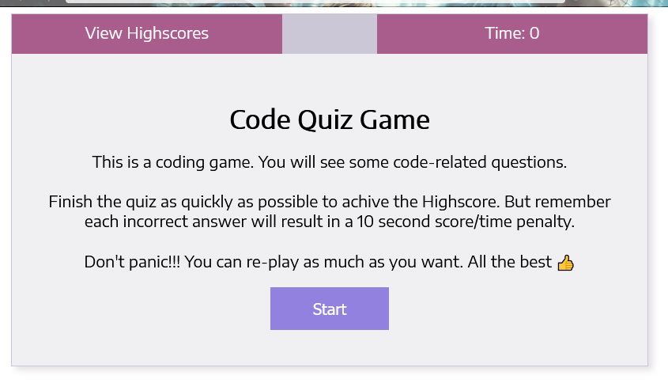
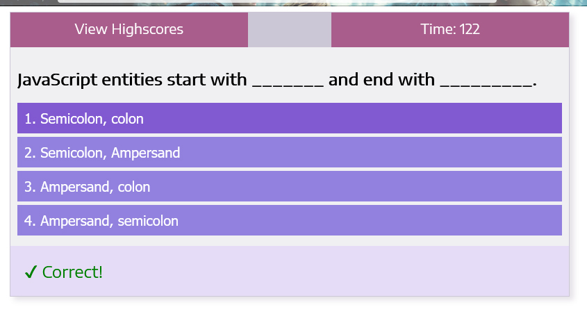
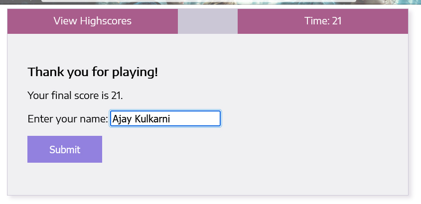
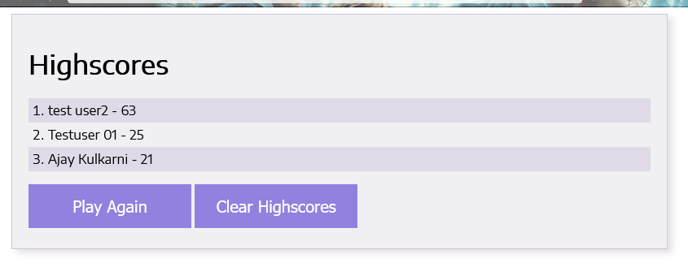

# 04 Web APIs: Code Quiz

For this project, I've developed a timed coding quiz with multiple-choice questions. This app runs in the browser and features dynamically updated HTML and CSS powered by JavaScript. This is fully responsive app with clean and polished user interface.

I was presented with the following acceptance criteria:

## Acceptance Criteria

```
GIVEN I am taking a code quiz
WHEN I click the start button
THEN a timer starts and I am presented with a question
WHEN I answer a question
THEN I am presented with another question
WHEN I answer a question incorrectly
THEN time is subtracted from the clock
WHEN all questions are answered or the timer reaches 0
THEN the game is over
WHEN the game is over
THEN I can save my initials and my score
```

## 💡 Application Features

- The intro page consists of:
  - View Highscore button: Clicking on this button will take you a new page (score.html). It will pull the scores from localstorage and display it in descending order. 
  - Quiz timer display.
  - A welcome to quiz message with rules on how to play the quiz.
  - Start button: Clicking on this button start the quiz and timer.
- Questions screen: 
  - The quiz has 10 questions.
  - Each question will have: A question title and four options.
  - If you select the correct answer, you will be guided to next question.
  - The wrong answer will result in a 10 second score/time penalty.
  - You will be guided to quiz end screen after attempting all the 10 questions or if the timer reaches to 0.
- Quiz-end screen:
  - This screen will display your score.
  - You will be asked to enter your name/initials.
  - Submit button: Clicking on this button will save your name and score in the localstorage. And It will redirect you to the Highscores page.
- Highscores Page:
  - This page will display the list of all Highscores.
  - It will show the user name and scores in descending order
  - Play again button: Clicking on this button will restart the quiz.
  - Clear Highscores button: Clicking on this button will delete all the score entries from the localstorage.

## Mock-up

Please find below the application screenshot:






## 🔗 Project Link

https://ajaykulkarni01.github.io/Code-Quiz/

   <br/>

---
